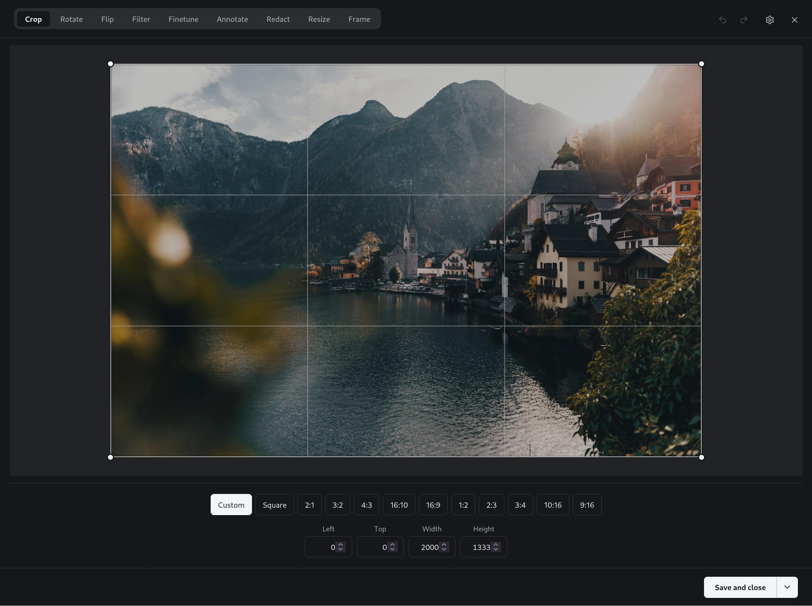

# Kalotyp

> An open-source image editor for Ghost.
> *From Greek* kalos *(beautiful) +* typos *(impression). Pronounced* /kaˈloʊ.tɪp/

Kalotyp is a focused, MIT-licensed image editor that drops into Ghost CMS.
Self-hosted Ghost users can install it through **Settings → Integrations → Pintura** by uploading the Kalotyp JS and CSS files — no changes to Ghost itself.



## Features

Nine tools, matching Ghost admin's look and feel:

- **Crop** — drag handles or pick a ratio (Square, 16:9, 4:3, and more), with exact pixel inputs.
- **Rotate** & **Flip** — straighten or mirror the image.
- **Filter** & **Finetune** — one-click looks plus brightness/contrast/saturation/sharpen adjustments.
- **Annotate** — text (web fonts, bold/italic, alignment), rectangles, ellipses, arrows, freehand, highlighter, and **emoji stickers** (searchable picker, place/move/resize/rotate).
- **Redact** — black-box or blur over sensitive areas.
- **Resize** & **Frame** — set output dimensions or add a coloured border.

Plus:

- **Follows Ghost's light/dark mode** automatically — it mirrors the admin's Night Shift setting with no configuration.
- **WYSIWYG** — the on-screen preview is byte-for-byte what the saved image bakes.
- **Keyboard-accessible** — every tool can be placed, nudged, and sized without a mouse.
- **Tiny and private** — ~75 KB gzipped, no telemetry, no third-party calls beyond the optional web fonts.

## Install

In Ghost admin, go to **Settings → Integrations → Pintura** and toggle the
integration on. The two fields in that modal are **file uploads**, so the normal
setup is to upload the build files (Option A). If you'd rather have Ghost pull
the files from a CDN, point it there through Ghost's config instead (Option B).

> "Pintura" here is the name of Ghost's built-in image-editor integration slot,
> not a reference to any particular editor. Kalotyp is an independent project and
> is not affiliated with or endorsed by that editor; it simply implements the
> integration interface Ghost exposes under this name.

### Option A — Upload the files

Download `kalotyp.js` and `kalotyp.css` from the
[latest release](https://github.com/magicpages/kalotyp/releases/latest) (or build
them locally with `pnpm build`), then upload both in the integration modal — the
JS field takes `kalotyp.js`, the CSS field takes `kalotyp.css`. That's the entire
setup — no changes to Ghost itself.

### Option B — Serve from a CDN (config override)

The upload fields don't accept a URL, but Ghost's runtime config can override
where it loads the editor from. Toggle the integration on in the admin, then set
the JS and CSS URLs in **one** of these two places and restart Ghost:

- **Environment variables** — `pintura__js` and `pintura__css` (Ghost maps the
  double underscore to nested config keys):

  ```
  pintura__js=https://cdn.jsdelivr.net/npm/@magicpages/kalotyp/dist/kalotyp.js
  pintura__css=https://cdn.jsdelivr.net/npm/@magicpages/kalotyp/dist/kalotyp.css
  ```

- **`config.production.json`** — a `pintura` block with `js` and `css` keys:

  ```json
  {
    "pintura": {
      "js": "https://cdn.jsdelivr.net/npm/@magicpages/kalotyp/dist/kalotyp.js",
      "css": "https://cdn.jsdelivr.net/npm/@magicpages/kalotyp/dist/kalotyp.css"
    }
  }
  ```

Every published release is served automatically from
[jsDelivr](https://www.jsdelivr.com/), a free, GDPR-compliant, multi-CDN that
doesn't log personal data. These URLs always serve the latest published release;
pin an exact version (e.g. `@magicpages/kalotyp@0.2.3/dist/kalotyp.js`) if you'd
rather upgrade deliberately. The same files are mirrored on
[unpkg](https://unpkg.com/) at
`https://unpkg.com/@magicpages/kalotyp/dist/kalotyp.js` if you prefer.

### Fonts & privacy

The text annotation tool offers the same web fonts Ghost's own admin uses,
loaded at runtime from [fonts.bunny.net](https://fonts.bunny.net) — a
GDPR-friendly, privacy-focused font CDN. No font bytes are bundled, and nothing
is sent to Magic Pages. If the CDN is unreachable (offline, strict CSP, or
air-gapped install), the editor falls back to the system font and keeps working;
saved images bake with whatever font is available. To allow the fonts under a
content-security policy, permit `fonts.bunny.net` in `style-src`/`font-src`.

The emoji sticker tool works out of the box with **no extra assets** — emoji
render with the operating system's native colour-emoji font, both in the picker
and when baked into the image. Nothing is bundled and nothing is fetched from a
third party, so the 2-file setup above (upload `kalotyp.js` + `kalotyp.css`) is
all you need, and there's no CSP or hosting to configure.

Because the OS emoji fonts are bitmap on macOS/iOS (Apple Color Emoji) and
Android/Linux (Noto), a glyph drawn larger than its native size would blur — so
sticker size is capped (see `EMOJI_MAX_SIZE`) to keep emoji crisp. The emoji
themselves look like whatever platform the editor runs on; the saved image bakes
those pixels, so viewers see a consistent result regardless of their device.

## Repository layout

```
kalotyp/
├── packages/
│   ├── core/    # framework-agnostic editor engine
│   ├── ui/      # default UI
│   └── ghost/   # Ghost adapter — produces dist/kalotyp.js + kalotyp.css
└── apps/
    ├── playground/   # standalone dev harness (no Ghost needed)
    └── ghost-test/   # docker-compose Ghost + Playwright E2E
```

## Local development

```bash
pnpm install
pnpm dev       # starts the playground at http://localhost:5173
pnpm build     # produces packages/ghost/dist/kalotyp.{js,css}
pnpm test
pnpm typecheck
pnpm lint
pnpm size      # checks the gzipped bundle stays under 300KB
```

## Contributing

Please read [`CONTRIBUTING.md`](./CONTRIBUTING.md) before opening a pull
request. Kalotyp is built clean-room — that section in particular is
non-negotiable.

## License

MIT. See [`LICENSE`](./LICENSE).
